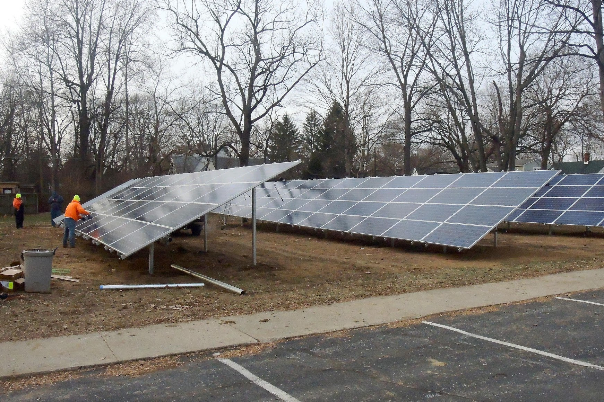

# UUI Solar Data

This project will enable data collection, aggregation, reporting & alerting, 
and visualization for the energy output of all solar arrays installed on
the UUI campus.

There are 3 separate operational systems, each with their own developer API:
1. SolarEdge
2. Enphase
3. Sunnyboy

A kiosk system, consisting of a Raspberry Pi 3 and HDMI wall-mounted monitor,
will display real-time updates and historical performance data for comparisons.
The visualization formats to be shown are TBD.

The Raspi 3 will be running a python process that collects data from the arrays in 1-hour intervals.
This data will be fed into a local instance of [Dash by Plotly](https://plot.ly/) for display and visualization. 

The list of things that need to be completed are as follows.

 1) ensure all listed times are saved in UTC and converted to ETC before being displayed
    1) all times should start at 0:00 UTC before being converted to ETC 
 2) dissiminate between 0 and NaN between systems. (see raw output of SolarEdge vs SunnyPortal)
 3) impliment display

Note#
Sunnyportal is 1hour ahead of utc
solarEdge is localtime
Enphase is utc on time